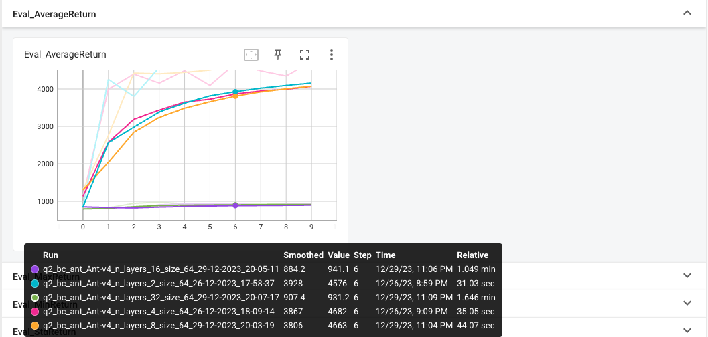

# Report
## Ant-V4
### Behavior Cloning
| size | n_layers | eval_avgreturn | expert_avgreturn |
|----------|----------|----------|----------|
| 64 | 2 | 848.7 | 4681.89 |
| 64 | 4 | 1135.0 | 4681.89 |
| 64 | 8 | 1307 | 4681.89 |
| 64 | 16 | 853.1 | 4681.89 |
| 64 | 32 | 796.1 | 4681.89 |
the best parameters are: size == 64; n_layers == 8
### DAgger
| size | n_layers | iter | eval_avgreturn | expert_avgreturn |
|----------|----------|----------|----------|----------|
| 64 | 2 | 10 | 4708.29 | 4712.43 |
| 64 | 4 | 10 | 4728.95 | 4712.43 |
| 64 | 8 | 10 | 4699.10| 4712.43 |
| 64 | 16 | 10 | 944.69 | 4712.43 |
| 64 | 32 | 10 | 936.25 | 4712.43 |
the best parameters are siz == 64; n_layers == 4
